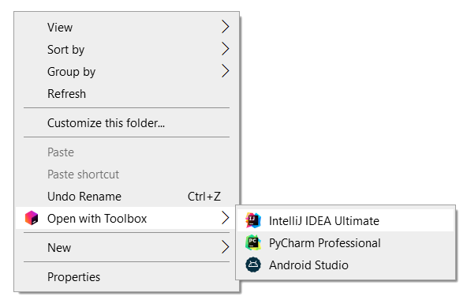

# Open with JetBrains Toolbox

This is a simple script that adds a context menu entry to open a directory or file with JetBrains IDEs installed through Toolbox. It is useful when you navigated to a project folder or specific config file and don't want to open the IDE and then navigate to the project folder or aforementioned file. You can just right click on the project folder and select the IDE you want to open it with.

## How to install:
___
1. Download [this repo](https://github.com/Pawloland/Open-with-Toolbox/archive/refs/heads/master.zip).
2. Extract downloaded files somewhere on the filesystem. Be aware that the directory you selected can not be deleted or moved after running script `install.ps1`.
3. Open PowerShell as administrator in a directory where you extracted downloaded files.
4. Run script `install.ps1` with the following command: `powershell -ExecutionPolicy Bypass -File .\install.ps1`.
5. Profit!

## How to uninstall:
___
1. Open PowerShell as administrator in a directory where you extracted downloaded files.
2. Run script `uninstall.ps1` with the following command: `powershell -ExecutionPolicy Bypass -File .\uninstall.ps1`.
3. Delete the directory with downloaded files.

## Additional info:
___
1. If you installed new IDEs or changed names of generated scripts, just repeat the install steps and the old setup will be replaced with the new one.
2. When uninstalling, some paths in registry will not be removed, because they can be used by other programs, but they will not in any way affect the system operation.
3. Only IDEs that have a launch script generated by Toolbox will have context menu entries.
4. Only some IDEs that have a launch script generated by Toolbox will have a full name in the context menu entry. The ones that do not have full one will have string retrieved from the directory name inside `%localappdata%\JetBrains\Toolbox\apps`. I hardcoded the full names of the IDEs that I use, but if you want to add more, you can edit the script `install.ps1` and add more.
5. Only the default install location of the Toolbox is supported. If you installed Toolbox in a custom location, you will have to manually edit the script `install.ps1` and change the variable `$toolbox_path` to the path where you installed Toolbox.
6. Ony the default location of IDEs launch scripts is supported (`%localappdata%\JetBrains\Toolbox\scripts` if you have not changed the script variable `$toolbox_path` as defined in point 5. If you have changed the location of scripts, it should be `$toolbox_path\JetBrains\Toolbox\scripts`, where `$toolbox_path` resolves to the Toolbox custom install directory).
7. File `nowindow.vbs` is a wrapper used for opening IDEs without a quick flash of a console window. It is called from registry, so if you remove or rename it, the IDEs will not open.
